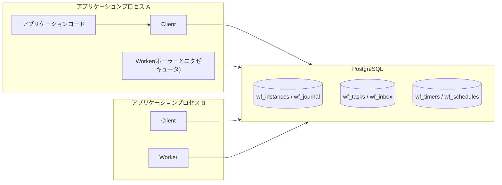
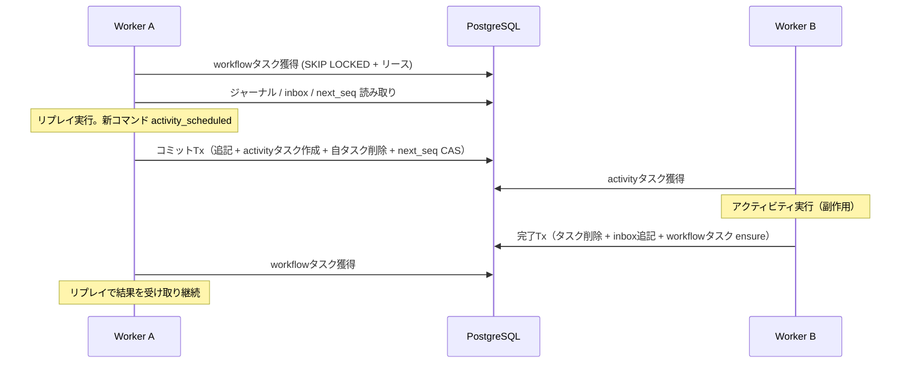
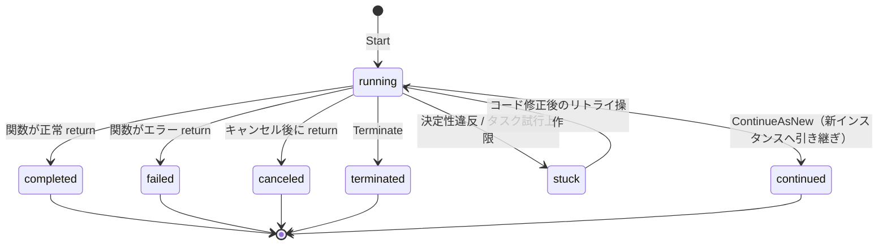

# アーキテクチャ

本書は durable-workflow の内部構造を定める。
中心となる問いは二つある。
「専用サーバーなしで、どうやってワークフローの実行を durable にするか」と、「複数のアプリケーションプロセスが同じ DB を共有しても、どうやって状態遷移を exactly-once に保つか」である。

## 全体構成

エンジンはアプリケーションプロセスに埋め込まれ、すべての永続化と排他制御を一つのリレーショナルデータベースで行う。
プロセス間の直接通信は存在せず、協調はすべて DB 経由で行う。



コンポーネントは三つに分かれる。

- **Client**：ワークフローの開始、シグナル送信、キャンセル、結果取得を行う。ワーカーを持たないプロセス（API サーバーなど）からも使える。
- **Worker**：タスクをポーリングして実行する。ワークフロータスク用とアクティビティタスク用のエグゼキュータプールを持つ。
- **Backend**：永続化と排他制御の抽象。参照実装は PostgreSQL で、開発とテスト向けに SQLite とインメモリ実装を提供する。

## 実行モデルの選択

durable execution の実現方式には、先行プロダクトから三つの選択肢が知られている。

| | A案：常駐ゴルーチン方式 | B案：完全イベントソーシング方式 | C案：ジャーナル再実行方式（採用） |
|---|---|---|---|
| 先行例 | DBOS Transact | Temporal, Cadence | go-workflows, durabletask-go, Restate SDK |
| 仕組み | ワークフローをゴルーチンとして常駐させ、待ちはプロセス内でブロックする。クラッシュ時のみ記録から再実行する | 履歴イベントと決定的スケジューラで任意のゴルーチンをリプレイする | 進行のたびに関数を先頭から再実行し、記録済みの結果を返して現在位置まで復元する |
| ワークフロー内の並行性 | ネイティブのゴルーチンに近い | `workflow.Go` などフル機能 | エンジン提供の Future と Select に限定 |
| 待機中のリソース | ゴルーチンとリースを占有し続ける | DB 行のみ | DB 行のみ |
| 再開できるプロセス | 所有プロセスのみ（死亡時に移管） | 任意 | 任意 |
| 実装コスト | 最小 | 最大（決定的スケジューラ、スティッキーキャッシュが必要） | 中 |

C案を採用する。
理由は、待機中のインスタンスが DB 行だけになり、リソースを占有せず、どのプロセスからでも再開できることにある。
これは「日単位のスリープを大量に抱える」というワークフローエンジンの典型的な負荷特性に合う。

A案を退ける理由は、スリープ中のインスタンスがゴルーチンと実行権を占有し続け、デプロイのたびに全インスタンスの再実行が集中することにある。
B案を退ける理由は、実装コストの大半が `workflow.Go`（ワークフロー内で任意のゴルーチンを使う機能）の決定的リプレイに費やされることにある。
並行実行の需要の多く（複数アクティビティの同時実行と待ち合わせ）は Future で表現でき、残り（独立した処理単位の並行実行）は子ワークフローで表現できるため、この機能は費用に見合わないと判断した。

## ジャーナルとリプレイ

インスタンスの状態は、状態スナップショットではなく **ジャーナル**（追記専用のイベント列）として永続化する。
ワークフロー関数の「現在位置」は、関数を先頭から再実行し、記録済みのイベントを順に返すことで復元する。
この方式が成り立つ条件は、ワークフロー関数が決定的であること、つまり同じイベント列に対して常に同じ呼び出し列を生成することである（制約の詳細は [03-api.md](03-api.md) に定める）。

### イベントの種類

イベントは三分類ある。
**コマンドイベント** はオーケストレーションの実行が生成する。
**完了イベント** は外部（アクティビティ完了、タイマー発火、シグナル）から届き、`ref_seq` で対応するコマンドイベントを指す。
**終端イベント** はインスタンスの終了を表す。

| type | 分類 | payload |
|---|---|---|
| workflow_started | 記録（開始時） | name, input |
| activity_scheduled | コマンド | name, input, retry_policy |
| timer_created | コマンド | fire_at |
| child_scheduled | コマンド | child_id, name, input |
| side_effect | コマンド（即値） | value |
| now_recorded | コマンド（即値） | value |
| version_marker | コマンド（即値） | change_id, version |
| activity_completed | 完了 | ref_seq, result |
| activity_failed | 完了 | ref_seq, error |
| timer_fired | 完了 | ref_seq |
| child_completed | 完了 | ref_seq, result |
| child_failed | 完了 | ref_seq, error |
| signal_received | 完了（相関なし） | name, payload |
| cancel_requested | 完了（相関なし） | なし |
| workflow_completed | 終端 | result |
| workflow_failed | 終端 | error |
| workflow_canceled | 終端 | なし |
| continued_as_new | 終端 | input |

完了イベントとコマンドイベントの対応付けは、履歴上の出現順ではなく `ref_seq` による相関で行う。
Temporal のような厳密な順序一致方式に比べて照合が単純になり、「待たれなかった完了イベント」（Select で敗れたタイマーの発火など）がジャーナルに残っていても正しく動く。

### リプレイと決定性違反の検出

リプレイでは、ワークフロー関数が生成する i 番目のコマンドを、ジャーナルの i 番目のコマンドイベントと突き合わせる。
type と名前（アクティビティ名など）が一致すればそのイベントの結果を返し、一致しなければ **決定性違反** としてインスタンスを stuck 状態に隔離する。
入力ペイロードは既定では比較しない。
シリアライズ表現の揺れによる誤検出が多いためで、この緩い照合でも呼び出し順序の変化（コードの非互換な変更や非決定的な分岐）は捉えられる。

stuck は終端ではない。
原因となったコードを修正してデプロイした後、運用操作（リトライ API）で running に戻せる。

### 履歴の肥大への対策

ジャーナルは追記専用のため、ループを持つ長寿命ワークフローでは際限なく伸びる。
対策は二段構えとする。

- イベント数が警告しきい値（既定 10,000）を超えたらメトリクスとログで警告する。
- ワークフロー側は ContinueAsNew（現在の入力で新しい実行に引き継ぎ、旧インスタンスを終端させる操作）で履歴を打ち切る。

リプレイのたびに全履歴を読み直すコストは、履歴をワーカー内にキャッシュする最適化（スティッキーキャッシュ）で削減できるが、初期リリースの範囲外とする（[04-plan.md](04-plan.md) 参照）。

## オーケストレーションの実行とサスペンド

ワークフロー関数は、ワークフロータスクの処理ごとに専用のゴルーチンで先頭から実行する。
`Future.Get` などの待ち受け API がジャーナルに未記録の結果に行き当たったとき、実行はそこで打ち切って中断する必要がある。

中断には `runtime.Goexit()` を使う。
ここまでに生成したコマンドは `workflow.Context` に蓄積済みなので、エグゼキュータはゴルーチンの終了を検知してそれらをコミットすればよい。
panic にセンチネル値を投げる方式も考えられるが、ユーザーコードの `recover()` に捕捉されて実行が壊れる事故があり得るため採らない。
`runtime.Goexit` は recover では捕捉できず、この事故が構造的に起きない。

`runtime.Goexit` はユーザーコードの defer を実行してからゴルーチンを終える。
したがってワークフロー内の defer は中断のたびに実行される。
これはワークフローコードの決定性制約（副作用を持たない）に defer も含まれることを意味し、[03-api.md](03-api.md) の制約一覧に明記する。

## タスクとリース

ワーカーが取り合う実行単位は `wf_tasks` テーブルの行である。
獲得は `FOR UPDATE SKIP LOCKED` で競合なく行い、リースは専用のカラムではなく `visible_at`（この時刻まで他のワーカーから見えない）の先送りで表現する。

```sql
WITH picked AS (
    SELECT id FROM wf_tasks
    WHERE kind = $1 AND queue = ANY($2) AND visible_at <= now()
    ORDER BY visible_at
    LIMIT $3
    FOR UPDATE SKIP LOCKED
)
UPDATE wf_tasks t
SET visible_at = now() + $4::interval,  -- リース期間だけ先送りする
    attempt    = t.attempt + 1,
    worker_id  = $5
FROM picked
WHERE t.id = picked.id
RETURNING t.*;
```

この表現には、専用のリース解放処理（reaper）が不要になる利点がある。
ワーカーがクラッシュすれば `visible_at` が経過した時点でタスクは自然に再獲得可能になり、リトライのバックオフ待ちも同じカラムで表現できる。
実行中のワーカーは、リース期間の半分を目安に `visible_at` を延長し続ける（長時間アクティビティ対応）。

ワークフロータスクには追加の不変条件を課す。

```sql
CREATE UNIQUE INDEX wf_tasks_wf_singleton ON wf_tasks (instance_id) WHERE kind = 'workflow';
```

インスタンスごとにワークフロータスクは常に高々 1 件であり、オーケストレーションの実行はインスタンス単位で直列化される。
この部分一意インデックスが、後述する状態遷移プロトコルの土台になる。

## 状態遷移プロトコル

本プロジェクトの正しさの核心は、「オーケストレーションの一歩」を単一の DB トランザクションで確定させることにある。
このプロトコルにより、ワークフローの状態遷移（ジャーナルへの追記とその派生効果）は exactly-once になる。

### ワークフロータスクの処理

1. **獲得**：ワークフロータスクをリース付きで獲得する。
2. **読み取り**：ジャーナル全件、inbox（未取り込みの完了イベント）、`next_seq`、DB 時刻を 1 回のスナップショットで読む。
3. **実行**：ロックを持たずにリプレイを実行する。inbox のイベントは読み取り順にジャーナルへ続く仮の seq を割り当てて可視化し、新たなコマンドと派生効果（アクティビティタスク、タイマー、子インスタンス、状態更新）を蓄積する。
4. **コミット**：単一トランザクションで確定する。

```sql
BEGIN;
-- 楽観ロック。他の誰かが先に進めていたら 0 行更新となり全体を破棄する
UPDATE wf_instances SET next_seq = $new, updated_at = now()
    WHERE id = $instance AND next_seq = $expected;
-- 取り込んだ完了イベントと新コマンドをジャーナルへ追記
INSERT INTO wf_journal (instance_id, seq, type, ref_seq, payload) VALUES ...;
-- 派生効果
INSERT INTO wf_tasks ...;      -- スケジュールされたアクティビティ
INSERT INTO wf_timers ...;
INSERT INTO wf_instances ...;  -- 子インスタンス
UPDATE wf_instances ...;       -- 終端時の status / result 更新
-- 後始末
DELETE FROM wf_inbox WHERE id = ANY($drained);
DELETE FROM wf_tasks WHERE id = $own_task;
-- 実行中に inbox へ新着があれば、自分で次のワークフロータスクを積み直す
INSERT INTO wf_tasks (kind, instance_id, queue)
    SELECT 'workflow', $instance, $queue
    WHERE EXISTS (SELECT 1 FROM wf_inbox WHERE instance_id = $instance)
    ON CONFLICT DO NOTHING;
COMMIT;
```

`next_seq` の楽観ロックがフェンシングトークンを兼ねる。
リース切れ後に別ワーカーが同じタスクを取り直した場合、先にコミットした側だけが勝ち、遅れた側（ゾンビ）は 0 行更新を検知してすべての書き込みを破棄する。
どちらが勝っても、ジャーナルには一つの遷移だけが記録される。

### 完了イベントの届け方と inbox

ジャーナルへの追記をワークフロータスクの処理に一本化するため、アクティビティ完了、タイマー発火、シグナルは、ジャーナルへ直接書かず `wf_inbox` へ積む。
これにより seq の採番者が常に一人になり、exactly-once の保証が `next_seq` の楽観ロックひとつに集約される。

アクティビティ完了のトランザクションは次のとおり。

```sql
BEGIN;
DELETE FROM wf_tasks WHERE id = $task;              -- 0 行なら結果を破棄して終了
INSERT INTO wf_inbox (instance_id, type, ref_seq, payload) VALUES ($instance, 'activity_completed', $seq, $result);
INSERT INTO wf_tasks (kind, instance_id, queue)     -- ワークフロータスクの ensure
    SELECT 'workflow', $instance, $queue
    WHERE (SELECT status FROM wf_instances WHERE id = $instance) = 'running'
    ON CONFLICT DO NOTHING;
COMMIT;
```

タスク行の DELETE が完了の排他を兼ねる。
リース切れで同じアクティビティが二重実行された場合、先にコミットした実行の結果だけが採用され、遅れた側は 0 行削除を検知して結果を破棄する。

### 起こし損ねが生じないことの確認

このプロトコルで唯一注意深い検討が必要な競合は、「ワークフロータスクのコミット」と「完了イベントの ensure」の同時実行である。
ワークフロータスクが inbox を確認した直後、コミットの前に完了イベントが届いた場合、ensure 側は既存のワークフロータスク行（削除がまだコミットされていない）と衝突して挿入を諦め、コミット側は新着 inbox を見ていない。
素朴に読むと、誰もインスタンスを起こさないままになる。

実際にはならない。
PostgreSQL の `ON CONFLICT DO NOTHING` は、衝突相手の行を削除中の未コミットトランザクションがあると、その決着を待つ。
削除がコミットされれば衝突は消え、ensure 側の挿入が成立して新しいワークフロータスクが積まれる。
削除がロールバックされれば行は残り、DO NOTHING が成立する（残ったタスクがいずれ inbox を取り込む）。
いずれの分岐でも起こし損ねは生じない。

この性質はバックエンドの実装契約とし、「実行中タスクの削除と並行した ensure が起こし損ねを生まないこと」をバックエンド適合テスト（[04-plan.md](04-plan.md)）の必須ケースに含める。

### 処理の流れ



## アクティビティの実行とリトライ

アクティビティタスクの `payload` には名前、入力、リトライポリシーを非正規化して持たせ、実行時にジャーナルを読まずに済ませる。

失敗時の扱いは失敗の種類で分かれる。

- **リトライ可能な失敗**（通常のエラー、panic、リース切れ）：ジャーナルには記録せず、`visible_at` をバックオフ分だけ先送りして再実行を待つ。試行回数はタスク行の `attempt` が持つ。
- **恒久的な失敗**（`max_attempts` 到達、または非リトライ指定のエラー）：タスクを削除し、`activity_failed` を inbox へ届ける。ワークフロー側にはエラーとして返り、ワークフローコードが対処を決める。

途中の試行をジャーナルに記録しない設計により、リトライがジャーナルを肥大させない。

アクティビティは at-least-once 実行である。
「実行は成功したが完了トランザクションの前にクラッシュした」場合に再実行されるため、これはこの構造の原理的な性質であり、なくすことはできない。
そのため冪等な実装をアクティビティの契約とし、冪等キーの材料（インスタンス ID、スケジュール seq、試行番号）をアクティビティのコンテキストから提供する。

## タイマー

`workflow.Sleep` などの相対時間は、読み取りフェーズで取得した DB 時刻を基準に絶対時刻へ変換し、`timer_created` イベントと `wf_timers` 行として記録する。
どのワーカーも、期限の来たタイマーを `SKIP LOCKED` で取り合い、次のトランザクションで発火させる。

```sql
BEGIN;
DELETE FROM wf_timers WHERE instance_id = $i AND seq = $s;  -- SKIP LOCKED で選んだ行
INSERT INTO wf_inbox (instance_id, type, ref_seq) VALUES ($i, 'timer_fired', $s);
INSERT INTO wf_tasks ... ON CONFLICT DO NOTHING;            -- workflowタスクの ensure
COMMIT;
```

発火は at-least-once だが、ジャーナルへの取り込みは inbox 経由で一度だけ行われるため、ワークフローから見たタイマーは一度だけ発火する。

## シグナル

シグナルの送信は inbox への挿入とワークフロータスクの ensure だけで完結する。
インスタンスが別のイベントを処理している最中でも、送信側はジャーナルに触れないため競合しない。
同名のシグナルが複数届いた場合、ワークフローは inbox への到着順（ジャーナルへの取り込み順）で受け取る。

## 子ワークフロー

子インスタンスの作成は、親の状態遷移トランザクションの中で行う（`child_scheduled` の追記と `wf_instances` への挿入が同時に確定する）。
子の終端は、子自身の状態遷移トランザクションの中で親の inbox へ `child_completed` または `child_failed` を届ける。
親子は同じ DB にあるため、どちらも追加の調整機構なしに原子的に行える。

子のワークフロー ID は既定で `{親ID}:{seq}` とし、明示的な指定も許す。

## キャンセルと強制終了

**キャンセル** は協調的な操作である。
`cancel_requested` が inbox 経由でジャーナルに取り込まれると、以降の待ち受け API（Sleep、Future.Get、ReceiveSignal）はキャンセルエラーを返す。
ワークフローコードはそれを受けて補償処理（クリーンアップのアクティビティ実行を含む）を行い、自らの判断で return する。
実行中のアクティビティは中断せず、完走させる。

**強制終了（Terminate）** は即時の操作である。
インスタンスを terminated に更新し、そのインスタンスの未実行タスクとタイマーを削除する。
実行中のアクティビティが後から完了しても、完了トランザクションのタスク行 DELETE が 0 行となるか、ensure が running 以外を検知して何もしないため、無視される。

## インスタンスの状態機械



## データモデル

参照実装（PostgreSQL）のスキーマを示す。
他のバックエンドは同等の構造を各エンジンの流儀で実装する。

```sql
CREATE TABLE wf_instances (
    id           text PRIMARY KEY,
    name         text NOT NULL,
    queue        text NOT NULL DEFAULT 'default',
    status       text NOT NULL DEFAULT 'running',
        -- running | completed | failed | canceled | terminated | stuck | continued
    input        jsonb,
    result       jsonb,
    failure      jsonb,
    parent_id    text,
    parent_seq   bigint,
    next_seq     bigint NOT NULL DEFAULT 1,  -- ジャーナル追記位置。楽観ロックのフェンシングトークンを兼ねる
    created_at   timestamptz NOT NULL DEFAULT now(),
    updated_at   timestamptz NOT NULL DEFAULT now(),
    completed_at timestamptz
);
CREATE INDEX wf_instances_visibility_idx ON wf_instances (status, name, created_at);

CREATE TABLE wf_journal (
    instance_id text   NOT NULL,
    seq         bigint NOT NULL,
    type        text   NOT NULL,
    ref_seq     bigint,           -- 完了イベントから対応するコマンドイベントへの相関
    payload     jsonb,
    recorded_at timestamptz NOT NULL DEFAULT now(),
    PRIMARY KEY (instance_id, seq)
);

CREATE TABLE wf_inbox (
    id          bigserial PRIMARY KEY,
    instance_id text NOT NULL,
    type        text NOT NULL,
    ref_seq     bigint,
    payload     jsonb,
    created_at  timestamptz NOT NULL DEFAULT now()
);
CREATE INDEX wf_inbox_instance_idx ON wf_inbox (instance_id, id);

CREATE TABLE wf_tasks (
    id           bigserial PRIMARY KEY,
    kind         text NOT NULL,   -- workflow | activity
    queue        text NOT NULL DEFAULT 'default',
    instance_id  text NOT NULL,
    ref_seq      bigint,          -- activity: 対応する activity_scheduled の seq
    payload      jsonb,           -- activity: 名前、入力、リトライポリシー（非正規化）
    attempt      int  NOT NULL DEFAULT 0,
    max_attempts int,
    visible_at   timestamptz NOT NULL DEFAULT now(),  -- リースとリトライ待ちを兼ねる
    worker_id    text,
    created_at   timestamptz NOT NULL DEFAULT now()
);
CREATE INDEX wf_tasks_claim_idx ON wf_tasks (kind, queue, visible_at);
CREATE UNIQUE INDEX wf_tasks_wf_singleton ON wf_tasks (instance_id) WHERE kind = 'workflow';

CREATE TABLE wf_timers (
    instance_id text   NOT NULL,
    seq         bigint NOT NULL,  -- timer_created の seq
    fire_at     timestamptz NOT NULL,
    PRIMARY KEY (instance_id, seq)
);
CREATE INDEX wf_timers_fire_idx ON wf_timers (fire_at);

CREATE TABLE wf_schedules (
    id          text PRIMARY KEY,
    cron        text NOT NULL,
    workflow    text NOT NULL,
    queue       text NOT NULL DEFAULT 'default',
    input       jsonb,
    next_run_at timestamptz NOT NULL,
    paused      boolean NOT NULL DEFAULT false,
    created_at  timestamptz NOT NULL DEFAULT now(),
    updated_at  timestamptz NOT NULL DEFAULT now()
);
```

スケジュール実行（cron）は次の性質で exactly-once にする。
期限の来たスケジュール行を SKIP LOCKED で取り合い、`{スケジュールID}:{予定時刻}` を ID とするインスタンスを開始して `next_run_at` を進める。
仮に二重に発火しても、ID の重複排除（FR-5）が二つ目の開始を無効にする。

## バックエンドインターフェース

バックエンドは SQL を露出せず、プロトコルの各ステップを操作として提供する。
トランザクション境界は操作の内側に閉じる。

```go
package backend

type Backend interface {
    Migrate(ctx context.Context) error

    // Client 系
    CreateInstance(ctx context.Context, inst NewInstance) error // ID 重複時 ErrAlreadyExists
    SendToInbox(ctx context.Context, instanceID string, ev Event) error // シグナル / キャンセル要求
    GetInstance(ctx context.Context, id string) (*Instance, error)
    GetJournal(ctx context.Context, id string, afterSeq int64) ([]Event, error)
    ListInstances(ctx context.Context, f InstanceFilter) ([]Instance, error)
    TerminateInstance(ctx context.Context, id string) error

    // Worker 系
    ClaimTasks(ctx context.Context, req ClaimRequest) ([]Task, error)
    ExtendLease(ctx context.Context, taskID int64, d time.Duration) error
    LoadWorkflow(ctx context.Context, instanceID string) (*WorkflowState, error) // ジャーナル + inbox + next_seq + DB時刻
    CommitAdvancement(ctx context.Context, adv Advancement) error               // 状態遷移Tx。競合時 ErrConflict
    CompleteActivity(ctx context.Context, taskID int64, ev Event) error         // 完了Tx。タスク消失時 ErrSuperseded
    RetryActivity(ctx context.Context, taskID int64, visibleAt time.Time) error
    FireDueTimers(ctx context.Context, limit int) (int, error)
    ClaimDueSchedules(ctx context.Context, limit int) ([]Schedule, error)
}

// Advancement は状態遷移トランザクションの入力一式。
type Advancement struct {
    InstanceID    string
    TaskID        int64
    ExpectedSeq   int64      // next_seq の楽観ロック値
    DrainedInbox  []int64    // 取り込んだ inbox 行の ID
    NewEvents     []Event    // seq 採番済みの追記イベント列
    ActivityTasks []NewTask
    Timers        []NewTimer
    Children      []NewInstance
    ParentNotify  *Event     // 自身が子として終端した場合の親への完了イベント
    Terminal      *TerminalUpdate // status / result / failure
}
```

インメモリバックエンドも同じインターフェースを実装し、[04-plan.md](04-plan.md) の適合テストスイートで PostgreSQL 実装と同じ性質を検証する。

## 信頼性セマンティクスの一覧

| 対象 | 保証 | 根拠 |
|---|---|---|
| ワークフローの状態遷移 | exactly-once | 単一トランザクションと next_seq の楽観ロック |
| アクティビティの実行 | at-least-once（冪等実装が契約） | リースとリトライ |
| アクティビティ結果の採用 | exactly-once | 完了Txのタスク行 DELETE による排他 |
| タイマー発火のワークフローへの反映 | exactly-once | inbox 経由の取り込み一本化 |
| シグナル | 送信側の責務で at-least-once。取り込みは到着分すべて | inbox は重複排除しない（重複送信は重複受信になる） |
| ワークフロー開始 | ID による重複排除で冪等 | 主キー制約 |
| スケジュール発火 | 実効 exactly-once | 予定時刻由来の ID と開始の重複排除 |

## 時刻の扱い

スケジューリングに関わる時刻（`visible_at`、`fire_at`、タイマーの基準時刻）はすべて DB の時計を使う。
アプリケーションサーバー間の時計ずれが、リースの早すぎる失効やタイマーの順序逆転を生まないためである。
`workflow.Now` が返す時刻もイベントとして記録した値であり、リプレイ時に変わらない。

## スケール特性と限界

この設計のスループット上限は DB に律速される。
特性を隠さず示す。

- インスタンス単体の遷移レートは、直列化（ワークフロータスクの singleton 制約）により DB のトランザクションレイテンシで頭打ちになる。高頻度のイベントを一つのインスタンスに集めず、子ワークフローやインスタンス分割で分散させる。
- 全体のタスクスループットは `wf_tasks` の獲得クエリと追記の書き込み性能で決まる。バッチ獲得と LISTEN/NOTIFY による通知（ポーリング間隔の短縮なしにレイテンシを下げる）を最適化として計画する（[04-plan.md](04-plan.md)）。
- ポーリング間隔（既定 1 秒）が、負荷が低いときのイベント反応時間の下限になる。

この特性は「アプリケーションと同じ DB で動く、中小規模のワークフロー基盤」という位置づけに沿ったものであり、Temporal が担う大規模専用基盤の置き換えは狙わない。

## 技術選定

依存は最小限に保つ。

- **PostgreSQL ドライバ**：`jackc/pgx/v5`
- **SQLite ドライバ**：`modernc.org/sqlite`（cgo 不要）
- **cron 式パーサ**：`robfig/cron/v3` のパーサのみ
- そのほかは標準ライブラリ（`encoding/json`、`log/slog`、`testing`）で構成する
