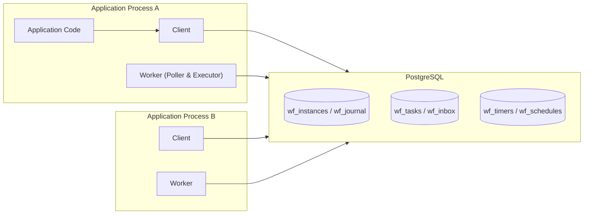
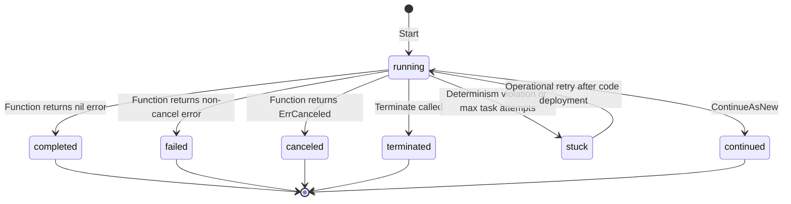

# Architecture

[English] | [日本語](ja/02-architecture.md)

This document defines the internal architecture of tasuki.  
The design addresses two primary questions:
1. How to make workflow execution durable without requiring a dedicated server cluster.
2. How to maintain exactly-once state transitions across multiple application processes sharing a single data store.

## Overall Architecture

The engine is embedded directly into application processes and relies entirely on a single data store for persistence and concurrency control.  
There is no direct communication between processes; all coordination occurs through the shared database.



While PostgreSQL is depicted above as the reference implementation, the persistence layer is abstracted behind a pluggable `backend.Backend` interface.  
The architecture consists of three primary components:

- **Client**: Initiates workflows, sends signals, requests cancellation, and awaits execution results. Can be used from processes without workers (e.g., API servers).
- **Worker**: Polls for and processes tasks. Contains separate executor pools for workflow tasks and activity tasks.
- **Backend**: Abstraction for persistence and concurrency control. PostgreSQL is the reference implementation; in-memory and SQLite backends are provided for testing and single-process setups. Full support is also provided for MySQL / MariaDB, TiDB, Spanner, DynamoDB, and Firestore.

## Execution Model Selection

Three architectures for durable execution are established across existing systems:

| | Option A: Resident Goroutines | Option B: Full Event Sourcing | Option C: Journal Replay (Adopted) |
|---|---|---|---|
| Precedents | DBOS Transact | Temporal, Cadence | go-workflows, durabletask-go, Restate SDK |
| Mechanism | Workflows run as resident goroutines; waiting states block in-memory. Re-execute from checkpoints only upon crash | Replay arbitrary goroutines using history events and a deterministic scheduler | Re-execute functions from the beginning upon each turn, returning recorded event results up to the current position |
| Workflow Concurrency | Native-like goroutines | Full support (`workflow.Go`, etc.) | Limited to engine-provided Futures and Selects |
| Idle Resource Usage | Goroutines and leases continuously occupied | Database rows only | Database rows only |
| Resumption Target | Originating process only (transferred on death) | Any worker | Any worker |
| Implementation Complexity | Low | Very High (requires deterministic scheduler and sticky cache) | Medium |

Option C was selected.  
When an instance is waiting, it consumes only database rows, occupies no compute resources, and can be resumed by any worker process. This directly matches the characteristic workload of workflow engines: handling thousands of concurrent workflows sleeping for days or weeks.

Option A was rejected because idle instances continuously consume memory and execution leases, causing massive re-execution storms during deployments. Option B was rejected because the bulk of its complexity is dedicated to deterministically replaying arbitrary goroutines (`workflow.Go`). Most practical concurrency needs (fan-out of multiple activities and waiting for results) are cleanly satisfied with Futures, and larger independent units of concurrency are better modeled as child workflows.

### Correspondence with the Durable Actor Model

tasuki models each workflow instance as a durable actor, without requiring a resident actor runtime.  
Idle workflows consume zero goroutines. When a workflow task is claimed, journal replay reconstructs the actor turn, which commits state atomically in a single turn.

| Actor Concept | tasuki Equivalent |
|---|---|
| Identity | Workflow `instance_id` |
| Mailbox | Undrained events in `wf_inbox` |
| Private state | Journal, instance metadata, and reconstructed `*workflow.Context` |
| Message dispatch | Claimed workflow task executed by a Worker |
| Single-threaded turn | Serialized processing per instance via `workflowActor` |
| Durable commit | `CommitAdvancement` with optimistic concurrency on `next_seq` |
| Supervision / recovery | Lease expiration, task retries, and incompatible worker Nack |

The `workflowActor` provides in-process turn serialization, while Backend leases and CAS ensure correctness across distributed processes.

## Journal and Replay

Instance state is persisted not as state snapshots, but as an append-only sequence of events called a **journal**.  
The current execution point of a workflow is reconstructed by executing the workflow function from the beginning and sequentially supplying recorded events.  
This model requires workflow functions to be deterministic: given the exact same sequence of events, they must produce the identical sequence of commands (detailed in [03-api.md](03-api.md)).

### Event Categories

Events are divided into three categories:
- **Command events**: Generated by the orchestration code.
- **Completion events**: Delivered from external actions (activity completion, timer trigger, signal reception), correlated to commands via `ref_seq`.
- **Terminal events**: Mark the conclusion of the instance.

| Type | Category | Payload |
|---|---|---|
| `workflow_started` | Recorded (at start) | `name`, `input` |
| `activity_scheduled` | Command | `name`, `input`, `retry_policy` |
| `timer_created` | Command | `fire_at` |
| `child_scheduled` | Command | `child_id`, `name`, `input` |
| `side_effect` | Command (immediate) | `value` |
| `local_activity` | Command (immediate) | `name`, `input`, `result` / `error` |
| `update_requested` | Completion (inbox) | `name`, `id`, `input` |
| `update_accepted` | Command (immediate) | `name`, `id` |
| `update_completed` | Command (immediate) | `name`, `id`, `result` / `error` |
| `now_recorded` | Command (immediate) | `value` |
| `version_marker` | Command (immediate) | `change_id`, `version` |
| `activity_completed` | Completion | `ref_seq`, `result` |
| `activity_failed` | Completion | `ref_seq`, `error` |
| `timer_fired` | Completion | `ref_seq` |
| `child_completed` | Completion | `ref_seq`, `result` |
| `child_failed` | Completion | `ref_seq`, `error` |
| `signal_received` | Completion (uncorrelated) | `name`, `payload` |
| `cancel_requested` | Completion (uncorrelated) | None |
| `workflow_completed` | Terminal | `result` |
| `workflow_failed` | Terminal | `error` |
| `workflow_canceled` | Terminal | None |
| `continued_as_new` | Terminal | `input` |

Completion events are matched to commands via `ref_seq` correlation rather than rigid positional order. This makes replay matching robust even when unawaited completion events (e.g., losing timer branches in a Select) exist in the journal.

### Replay and Determinism Violation Detection

During replay, the $i$-th command generated by the workflow function is verified against the $i$-th recorded command in the journal.  
If the command type and name match, the recorded result is returned. If they mismatch, a **determinism violation** is detected, and the instance is quarantined into the `stuck` status.  
Payloads are not compared during matching by default to prevent false positives from serialization variations; this relaxed check remains fully capable of catching reordering, incompatible code changes, or non-deterministic branching.

`stuck` is not a terminal state. Once the offending code is corrected and redeployed, the instance can be transitioned back to `running` via operational retry APIs.

### History Growth Mitigations

Because journals are append-only, long-running looping workflows can grow unboundedly. Several mitigations are built into the engine:

- If journal event count reaches `WorkerOptions.JournalWarnThreshold` (default 10,000; 0 uses default, negative disables), the worker logs a warning and emits a metric without interrupting execution.
- Workflows can call `workflow.ContinueAsNew` to reset their journal history and hand off execution to a new instance (the previous instance reaches `continued`, with ID `{id}~{seq}`).
- Re-reading full histories during replay is avoided using the Worker's in-memory sticky cache.

## Orchestration Execution and Suspension

Workflow functions execute in a dedicated goroutine per workflow task.  
When an API such as `Future.Get` encounters a command whose completion event is not yet in the journal, execution must be suspended immediately.

Suspension is performed using `runtime.Goexit()`.  
Commands generated up to that point are accumulated in `*workflow.Context`, and the executor commits them upon detecting the goroutine termination.  
Unlike throwing sentinel panics, which can be inadvertently caught by user-space `recover()` blocks, `runtime.Goexit()` cannot be intercepted by `recover()`.

`runtime.Goexit()` executes pending `defer` statements before exiting. Therefore, defers inside a workflow function run on every suspension. Workflow defers must consequently adhere to determinism constraints and contain no external side effects (see [03-api.md](03-api.md)).

## Tasks and Leases

Tasks are the fundamental execution unit claimed by workers (represented by rows in `wf_tasks` in relational backends).  
Leases are represented not by a dedicated locking table, but by advancing `visible_at` (hiding the task from other workers until that timestamp).

Two claiming strategies are used depending on data store capabilities:
- **Lock-based claiming**: Uses `FOR UPDATE SKIP LOCKED` to concurrently claim candidate rows without lock contention (PostgreSQL, MySQL 8.0+, MariaDB 10.6+).
- **Conditional-update claiming**: Reads due candidates via snapshot and updates `visible_at` one by one with optimistic CAS, discarding contenders (for Spanner, DynamoDB, and Firestore).

Both strategies provide identical safety guarantees (exclusive execution rights during the lease window). The PostgreSQL claim query is shown below:

```sql
WITH picked AS (
    SELECT id FROM wf_tasks
    WHERE kind = $1 AND queue = ANY($2) AND visible_at <= now()
    ORDER BY visible_at
    LIMIT $3
    FOR UPDATE SKIP LOCKED
)
UPDATE wf_tasks t
SET visible_at = now() + $4::interval,  -- advance lease deadline
    attempt    = t.attempt + 1,
    worker_id  = $5
FROM picked
WHERE t.id = picked.id
RETURNING t.*;
```

This design eliminates the need for a separate lease reaper. If a worker crashes, the task becomes reclaimable as soon as `visible_at` expires. Exponential backoff delays use the same column.  
Active workers periodically renew `visible_at` (typically at half the lease duration) to accommodate long-running tasks. Workers only claim tasks up to available semaphore capacity (`ClaimLimit` vs free slots), preventing queued tasks from starving lease renewal.

## Worker Shutdown Contract

`Worker.Shutdown(ctx)` shuts down gracefully in four phases:

- **Loop Termination**: Stops task polling loops and rejects newly detached activities.
- **In-flight Activity Wait**: Waits for running activities to finish within the deadline of `ctx`. Completed activities commit their results, preventing duplicate execution by other workers.
- **Lease Release**: Releases leases on remaining uncompleted tasks within `ShutdownReleaseTimeout` (default 5s) by setting `visible_at = now()`.
- **Enforced Deadline**: Exits once `ctx` expires, ensuring `Shutdown` never blocks indefinitely even if the data store is unreachable.

## Workflow Task Singleton Invariant

To guarantee serialized execution per workflow instance:

```sql
CREATE UNIQUE INDEX wf_tasks_wf_singleton ON wf_tasks (instance_id) WHERE kind = 'workflow';
```

At any time, at most one workflow task exists per instance. On stores without partial unique indexes, this invariant is enforced via generated columns (MySQL/MariaDB), `NULL_FILTERED` indexes (Spanner), or by using the instance ID directly as the task primary key (DynamoDB, Firestore).

## Exactly-Once State Transition Protocol

The core correctness of tasuki lies in committing a single workflow advancement within an atomic database transaction.

### Workflow Task Turn

1. **Claim**: Acquire the workflow task with an active lease.
2. **Read**: Read the journal, undrained inbox events, current `next_seq`, and the database timestamp in a single snapshot.
3. **Execute**: Replay workflow code without holding database locks. Assign tentative sequence numbers to inbox events, accumulating generated commands (activity tasks, timers, child instances, status updates).
4. **Commit**: Atomically persist all changes in a single transaction:

```sql
BEGIN;
-- Optimistic CAS on next_seq acting as a fencing token
UPDATE wf_instances SET next_seq = $new, updated_at = now()
    WHERE id = $instance AND next_seq = $expected;

-- Append drained inbox events and new commands to journal
INSERT INTO wf_journal (instance_id, seq, type, ref_seq, payload) VALUES ...;

-- Emit side-effect tasks
INSERT INTO wf_tasks ...;      -- Scheduled activities
INSERT INTO wf_timers ...;
INSERT INTO wf_instances ...;  -- Child workflow instances
UPDATE wf_instances ...;       -- Terminal updates (status, result, failure)

-- Cleanup
DELETE FROM wf_inbox WHERE id = ANY($drained);
DELETE FROM wf_tasks WHERE id = $own_task;

-- Re-enqueue workflow task if new inbox events arrived during replay
INSERT INTO wf_tasks (kind, instance_id, queue)
    SELECT 'workflow', $instance, $queue
    WHERE EXISTS (SELECT 1 FROM wf_inbox WHERE instance_id = $instance)
    ON CONFLICT DO NOTHING;
COMMIT;
```

`next_seq` acts as an optimistic fencing token. If another worker reclaimed the task after a lease expiry, the first committer wins; the slower worker observes 0 updated rows and rolls back, ensuring only one valid transition is ever recorded.

### Inbox Pattern for Completions

To serialize sequence numbering through workflow tasks, external events (activity results, timer firings, signals) are written to `wf_inbox` rather than directly to the journal.  
Activity completion transaction:

```sql
BEGIN;
DELETE FROM wf_tasks WHERE id = $task;              -- 0 rows indicates obsolete execution
INSERT INTO wf_inbox (instance_id, type, ref_seq, payload) VALUES ($instance, 'activity_completed', $seq, $result);
INSERT INTO wf_tasks (kind, instance_id, queue)     -- Ensure workflow task exists
    SELECT 'workflow', $instance, $queue
    WHERE (SELECT status FROM wf_instances WHERE id = $instance) = 'running'
    ON CONFLICT DO NOTHING;
COMMIT;
```

### Absence of Missed Wakeups (Invariant I1)

A critical concurrency edge case is the race between a workflow task committing and a completion event calling ensure.  
If a completion arrives immediately after the workflow task reads the inbox, the ensure could conflict with the existing task row (not yet deleted), while the committing transaction missed the new inbox item.

tasuki enforces invariant **I1**:
> **I1 (No Missed Wakeup)**: For any `running` instance, if unconsumed events exist in `wf_inbox`, a workflow task will eventually be runnable.

In PostgreSQL, I1 is guaranteed by the locking semantics of `ON CONFLICT DO NOTHING`, which waits on conflicting uncommitted deletes. On optimistic stores (Spanner, DynamoDB, Firestore), conflicting transactions abort and retry, ensuring the post-commit state is observed.

```mermaid
sequenceDiagram
    participant WA as Worker A
    participant DB as PostgreSQL
    participant WB as Worker B
    WA->>DB: Claim workflow task (SKIP LOCKED + lease)
    WA->>DB: Read journal / inbox / next_seq
    Note over WA: Replay execution; emit activity_scheduled
    WA->>DB: Commit Tx (append journal + create activity task + delete own task + next_seq CAS)
    WB->>DB: Claim activity task
    Note over WB: Execute activity (side effects)
    WB->>DB: Complete Tx (delete task + append inbox + ensure workflow task)
    WA->>DB: Claim workflow task
    Note over WA: Replay receives result and continues
```

## Activity Execution and Retries

Activity tasks contain normalized metadata (name, input, retry policy) to avoid reading journals during activity execution.

- **Retriable failures** (transient errors, panics, lease timeouts): Not recorded in the journal; `visible_at` is backed off and `attempt` is incremented.
- **Permanent failures** (`max_attempts` reached or `NonRetryable` error): Task is deleted and `activity_failed` is appended to `wf_inbox`. The workflow receives the error and handles compensation.

Activities follow an **at-least-once** execution contract. If a worker crashes after completing the business operation but before committing the database transaction, the activity will be re-executed. Activities should be idempotent, using the `IdempotencyKey` provided via `activity.GetInfo(ctx)`.

## Timers

Relative durations (`workflow.Sleep`) are converted to absolute timestamps using the database clock during the read phase and persisted as `timer_created` events and `wf_timers` rows.  
Workers claim due timers via `SKIP LOCKED` and deliver `timer_fired` to `wf_inbox`. Because deduplication happens through the inbox and journal, timers fire exactly once from the workflow's perspective.

## Signals

Signals are written directly to `wf_inbox` and ensure a workflow task. Senders never touch the journal, avoiding concurrency contention with active workflow tasks. Multiple signals with the same name are processed in inbox insertion order.

## Child Workflows

Child instances are created inside the parent's state transition transaction (`child_scheduled` event and child `wf_instances` row commit simultaneously).  
Child completion delivers `child_completed` or `child_failed` to the parent's inbox within the child's terminal transaction. Child IDs default to `{parentID}:{seq}`.

## Cancellation and Termination

- **Cancellation**: Cooperative. A `cancel_requested` event causes future waiting points (`Sleep`, `Future.Get`, `ReceiveSignal`) to return `workflow.ErrCanceled`. The workflow can run cleanup activities and return. In-flight activities run to completion.
- **Termination**: Immediate. The instance status updates to `terminated`, and all pending tasks and timers for that instance are purged.

## Instance State Machine



## Data Model (PostgreSQL Reference Implementation)

```sql
CREATE TABLE wf_instances (
    id           text PRIMARY KEY,
    name         text NOT NULL,
    queue        text NOT NULL DEFAULT 'default',
    status       text NOT NULL DEFAULT 'running',
        -- running | completed | failed | canceled | terminated | stuck | continued
    input        jsonb,
    result       jsonb,
    failure      jsonb,
    parent_id    text,
    parent_seq   bigint,
    next_seq     bigint NOT NULL DEFAULT 1,  -- Fencing token & optimistic lock
    search_attributes jsonb NOT NULL DEFAULT '{}'::jsonb, -- Filterable string attributes
    memo         jsonb NOT NULL DEFAULT '{}'::jsonb, -- Display metadata
    created_at   timestamptz NOT NULL DEFAULT now(),
    updated_at   timestamptz NOT NULL DEFAULT now(),
    completed_at timestamptz
);
CREATE INDEX wf_instances_visibility_idx ON wf_instances (status, name, created_at);

CREATE TABLE wf_journal (
    instance_id text   NOT NULL,
    seq         bigint NOT NULL,
    type        text   NOT NULL,
    ref_seq     bigint,
    payload     jsonb,
    recorded_at timestamptz NOT NULL DEFAULT now(),
    PRIMARY KEY (instance_id, seq)
);

CREATE TABLE wf_inbox (
    id          bigserial PRIMARY KEY,
    instance_id text NOT NULL,
    type        text NOT NULL,
    ref_seq     bigint,
    payload     jsonb,
    created_at  timestamptz NOT NULL DEFAULT now()
);
CREATE INDEX wf_inbox_instance_idx ON wf_inbox (instance_id, id);

CREATE TABLE wf_tasks (
    id           bigserial PRIMARY KEY,
    kind         text NOT NULL,   -- workflow | activity
    queue        text NOT NULL DEFAULT 'default',
    instance_id  text NOT NULL,
    ref_seq      bigint,
    payload      jsonb,
    attempt      int  NOT NULL DEFAULT 0,
    max_attempts int,
    visible_at   timestamptz NOT NULL DEFAULT now(),
    worker_id    text,
    created_at   timestamptz NOT NULL DEFAULT now()
);
CREATE INDEX wf_tasks_claim_idx ON wf_tasks (kind, queue, visible_at);
CREATE UNIQUE INDEX wf_tasks_wf_singleton ON wf_tasks (instance_id) WHERE kind = 'workflow';

CREATE TABLE wf_timers (
    instance_id text   NOT NULL,
    seq         bigint NOT NULL,
    fire_at     timestamptz NOT NULL,
    PRIMARY KEY (instance_id, seq)
);
CREATE INDEX wf_timers_fire_idx ON wf_timers (fire_at);

CREATE TABLE wf_schedules (
    id          text PRIMARY KEY,
    cron        text NOT NULL,
    workflow    text NOT NULL,
    queue       text NOT NULL DEFAULT 'default',
    input       jsonb,
    next_run_at timestamptz NOT NULL,
    paused      boolean NOT NULL DEFAULT false,
    created_at  timestamptz NOT NULL DEFAULT now(),
    updated_at  timestamptz NOT NULL DEFAULT now()
);
```

Cron schedules execute with exactly-once guarantees: workers claim due schedules via `SKIP LOCKED`, advance `next_run_at`, and start an instance with ID `{scheduleID}:{scheduledTime}`. Duplicate starts are rejected by primary key deduplication.

## Backend Interface

```go
package backend

type Backend interface {
    Migrate(ctx context.Context) error
    Capabilities() Capabilities

    // Client operations
    CreateInstance(ctx context.Context, inst NewInstance) error
    SendToInbox(ctx context.Context, instanceID string, ev Event) error
    GetInstance(ctx context.Context, id string) (*Instance, error)
    GetJournal(ctx context.Context, id string, afterSeq int64) ([]Event, error)
    ListInstances(ctx context.Context, f InstanceFilter) ([]Instance, error)
    TerminateInstance(ctx context.Context, id string) error

    // Worker operations
    ClaimTasks(ctx context.Context, req ClaimRequest) ([]Task, error)
    ExtendLease(ctx context.Context, t Task, d time.Duration) error
    LoadWorkflow(ctx context.Context, instanceID string) (*WorkflowState, error)
    CommitAdvancement(ctx context.Context, adv Advancement) error
    CompleteActivity(ctx context.Context, taskID int64, ev Event) error
    RetryActivity(ctx context.Context, taskID int64, delay time.Duration) error
    NackTask(ctx context.Context, t Task, delay time.Duration) error
    FireDueTimers(ctx context.Context, limit int) (int, error)
    ClaimDueSchedules(ctx context.Context, limit int) ([]Schedule, error)
}
```

## Implementation Contract and Supported Stores

| Store | Task Claiming | Singleton Enforcement | Advancement Atomicity | Clock Source |
|---|---|---|---|---|
| PostgreSQL (Reference) | Lock-based (`SKIP LOCKED`) | Partial unique index | Single transaction | Server clock |
| SQLite | Single-writer lock | Partial unique index | Single transaction | Local clock |
| MySQL / MariaDB | Lock-based (`SKIP LOCKED`) | Generated column + unique index | Single transaction | Server clock |
| TiDB | MySQL compatible | Same as MySQL | Single transaction (retry on conflict) | TSO consistent clock |
| Spanner | Conditional update | `NULL_FILTERED` unique index | Read-write transaction | Server clock |
| DynamoDB | GSI conditional update | Instance ID as item key | `TransactWriteItems` (100 item limit) | Client clock |
| Firestore | Query + conditional update | Document ID as instance ID | Transaction (500 write limit) | Client clock |

On stores with write size limitations, the backend advertises `Capabilities.MaxAdvancementEffects`. The engine truncates fan-outs to fit within budget and commits only a prefix, leaving the rest for follow-up turns (see [09-limits.md](09-limits.md)).

## Notification and Wakeup Mechanisms

To minimize latency caused by poll intervals, tasuki provides store-specific wakeup mechanisms:

- **PostgreSQL**: Uses `LISTEN`/`NOTIFY` on channel `tasuki_tasks` for task wakeups and `tasuki_terminal` for waiting client results. `PollInterval` remains the fallback and timer cadence.
- **In-process Hub (`backend/hub`)**: memory, SQLite, MySQL, and Spanner share an in-process pub/sub hub to immediately notify workers and clients within the same process.
- **Cross-process Wakeups (DynamoDB / Firestore)**:
  - DynamoDB: Combines `wf_wake` tables (DynamoDB Streams enabled) with wake item polling to wake workers across process boundaries.
  - Firestore: Uses realtime document snapshot listeners on `wf_notify` to propagate wakeups across distributed processes.
- **Correctness Guarantees**: All notifications are strictly **hints**. Even if notifications are dropped, delayed, or duplicated, safety is unconditionally guaranteed by `ClaimTasks`, `next_seq` CAS, and leases.

## Sticky Cache and Batch Advancements

- **Sticky Journal Cache**: Workers maintain an in-memory LRU cache of recent journal events keyed by instance. During replay, the worker checks the database `next_seq` against the cache's latest sequence and fetches only incremental events via `GetJournal(ctx, instanceID, afterSeq)`.
- **Batch Advancements (`CommitAdvancements`)**: Workers can batch advancements for multiple workflow tasks into a single transaction per tick, amortizing database write latency (falls back sequentially on DynamoDB if operations exceed 100 items).

## Reliability Semantics Summary

| Target | Guarantee | Basis |
|---|---|---|
| Workflow state transitions | Exactly-once | Single transaction and `next_seq` optimistic lock |
| Activity execution | At-least-once (idempotency required) | Leases and retries |
| Activity result recording | Exactly-once | Task row DELETE mutual exclusion |
| Timer firing reflection | Exactly-once | Inbox serialization |
| Signals | Default: at-least-once. With `WithDedupeID`: at-most-once | Unique constraint on `wf_signal_dedupe` |
| Workflow starts | Idempotent | Primary key constraint on instance ID |
| Schedule execution | Effectively exactly-once | Scheduled-time instance ID deduplication |

## Time Handling

Scheduling timestamps (`visible_at`, `fire_at`) use the data store's authoritative clock whenever available. On stores lacking authoritative clocks (DynamoDB, Firestore), worker client clocks are used with configured safety margins. Clock drift impacts operational efficiency (e.g., extra retries on premature expiration) but never violates safety, as exactly-once transitions are guarded by `next_seq` CAS and task deletion locks.

## Scaling Characteristics and Limits

- Single-instance throughput is bound by database transaction round-trip latency due to task serialization. High-throughput events must be partitioned across instances or broken down using child workflows.
- Aggregate task throughput is bound by database write capacity. Batch claiming, batch advancement, and store notification hooks reduce polling and commit overhead.
- In low-traffic workloads, `PollInterval` sets the floor for event reaction times when notifications are unavailable.

### Hot Instances and Partitioning Guidelines

Because only one workflow task runs at a time per instance, concentrating frequent external events onto a single instance will bottleneck throughput:

- **Do not** fan-in many high-frequency events into a single instance (e.g., aggregating all tenant events).
- **Partition by key**: Shard workflows by customer ID, tenant ID, or device ID.
- **Use child workflows**: Delegate independent concurrent branches using `ExecuteChild` / `ExecuteChildAsync`.
- **Note that `ContinueAsNew`** addresses journal size, not concurrency bottlenecks.
